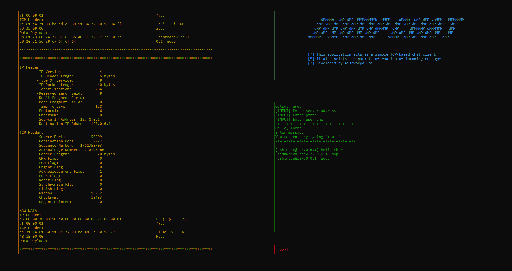

# DUMPCHAT
## Simple chat-client with packet dumps for Microsoft Windows.

Dumpchat is socket based chat client which dumps packet data information as well.

## Binaries

- The repository contains a server configured to run on port 7777.
- The message client has command-line interface based on curses.

## Libraries

- Winapi functions are used for memory management and multi-threading.
- Socket programming is done through winsock2.
- Curses interface is made with the help of pdcurses.

## Output

  <kbd>
    
  </kbd>

